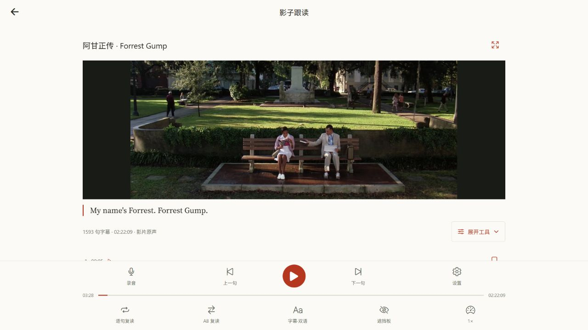
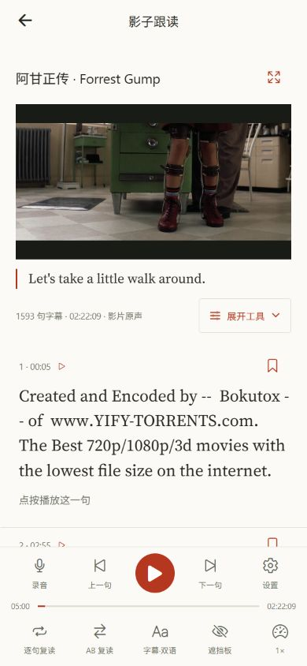

# 跟读视频与可折叠工具

视频原先固定为 170 像素高，两行练习工具始终显示，桌面上实际画面偏小。本次默认收起两行工具，并按窗口尺寸增大视频。

## 界面行为

- 字幕信息右侧提供「展开工具／收起工具」按钮，带箭头和展开状态，点击区域至少 44 像素高。
- 展开后保留自动滚动、已收藏句、自动分段、讲解、词汇、编辑、查找、更多八项工具；折叠只改变工具的显示状态。
- 视频根据窗口高度与内容宽度计算尺寸，底部播放、录音、复读和字幕控制继续可用。
- 工具状态独立于播放器和媒体来源，播放中展开、收起不会重新加载视频或重置播放进度。

## 验证

完整 `npm run check` 通过：客户端 86 套／440 项、服务端 62 个文件／366 项、共享契约 52 项、小程序 9 项，共 867 项测试。包含实际 Expo Web VideoView 的播放进度、媒体实例保留与签名更新回归。全工作区 TypeScript 和 Lint 通过，前端保留原有 24 条警告、零错误，两个修改文件单独 ESLint 检查也通过。

生产 Web 导出 39 条路由，Cloudflare 静态资源准备与部署预演通过；扫描 833 个客户端文件和六项实际服务端密钥，无泄漏。

正式 Web 已部署，版本为 `8fc3c97f-7832-42a8-a33c-f2281d22d844`。线上入口 `entry-c06811aa5faf42525305d91c62d3d469.js` 返回 200，解压后 29,330,894 字节，与本地发布包完全一致，SHA-256 为 `dddc8c95a3ac2a62bbc289fc0ac01756f9dd72bc910b8c58c916ec4cc331d357`。

真实浏览器验证：1280×720 桌面默认视频约 302 像素高，展开播放器后约 490 像素高；390×844 手机下为 350×197 像素。工具展开、收起时原音继续播放，媒体来源一致、播放时间持续增加；字幕定位、暂停和放大操作通过，浏览器无错误。手机按钮为 117×44 像素，八项工具展开后仍为两行。验证后已恢复桌面视口。

原始构建、全量检查与部署日志位于忽略提交的 `.local-test-results/speaking/collapsible-tools-*`。
