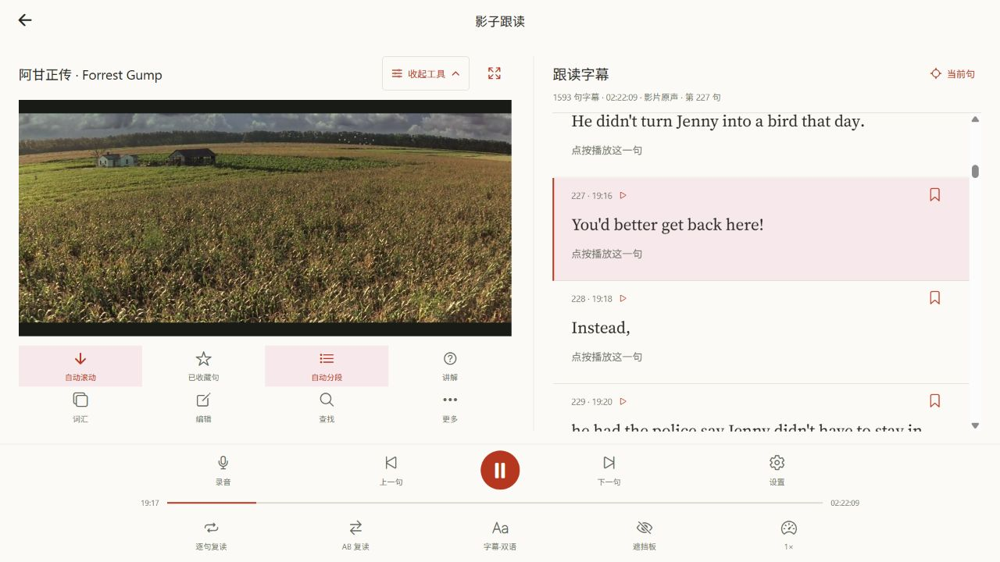
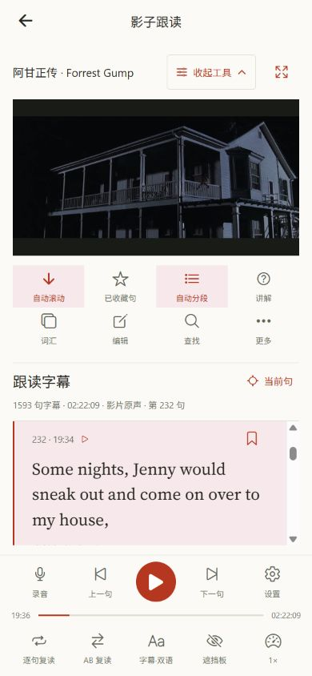

# 跟读页左右两栏与独立字幕滚动

跟读页原先将视频、工具和字幕放在同一个滚动列表中，练习后面的句子时视频会离开视野。现在桌面使用左右两栏：左侧保留播放器和练习工具，右侧只滚动字幕，底部播放控制继续固定显示。沿用现有的米白背景、衬线英文字幕、粉色选中状态和红色操作按钮。

## 界面行为

- 桌面宽度达到 960 像素，或横屏宽度达到 760 像素时显示两栏；手机竖屏使用上下布局，视频也不随字幕滚走。
- 自动滚动、已收藏句、自动分段、讲解、词汇、编辑、查找、更多八项工具默认展开，仍可通过「收起工具／展开工具」折叠。
- 字幕标题、句数、时长和当前句编号保留在右栏顶部；「当前句」按钮可以将字幕重新定位到播放位置。手机上当前句对齐字幕栏顶部，避免小屏被上方字幕占据空间。查找输入也留在字幕栏顶部。
- 视频根据左栏宽度和可用高度调整尺寸，展开播放器时扩大左栏。调整窗口或折叠工具不更换媒体来源，不重置播放进度。
- Web 字幕使用独立滚动容器，按实际字幕位置定位；浏览器通过 `content-visibility` 跳过离屏字幕的布局，字幕行使用 React memo，播放进度更新不重复渲染整列。原生端继续使用 FlatList。两种路径都保持播放器挂载。
- 底部按钮使用剩余宽度分配空间，修正手机上的轻微横向溢出。

## 验证

完整 `npm run check` 通过：当时客户端 86 套／440 项、服务端 62 个文件／366 项、共享契约 52 项、小程序 9 项。新增三项字幕位置回归测试后，最终客户端 87 套／443 项全量测试再次通过，合计验证 870 项。TypeScript 和 Lint 通过，前端原有 24 条警告、零错误；修改文件单独 ESLint 检查通过。VideoView 回归检查确认播放器尺寸改变后仍保留原视频实例和正确时长，新增测试覆盖手机换行后的实际位置、桌面滚动位置和原生端回退。

本地真实浏览器使用 R2 中的《阿甘正传》验证：1593 句字幕可直接跳到影片末尾；查找「Jenny」后点选第 205 句，退出查找后完整字幕能继续跟随播放。在第 200 多句播放时关闭自动滚动并连续翻页，字幕列表继续滚动，页面滚动位置保持为零，视频顶部保持在 128 像素，媒体来源一致、播放时间持续增加。工具折叠与展开也保持播放。

390×844 手机验证采用上下布局，视频为 358×195 像素，字幕滚动后视频顶部仍保持在 124 像素，页面宽度与视口宽度都为 390 像素，无横向溢出。在第 259 句恢复进度后，字幕顶端与当前句相差不足 1 像素；字幕向后翻至第 261–262 句、向前翻至第 258–260 句，视频位置不变。横竖屏切换、手动返回当前句和跳到第 1593 句通过。生产 Web 导出 39 条路由，静态资源准备和部署预演通过；检查 836 个客户端文件和六项配置的服务端密钥，没有泄漏。

本次仅部署 Web 前端，不涉及服务端、数据库或 R2 资源变更。

## 发布记录

正式 Web 已部署，版本为 `d9009edc-cfae-4d9f-9c9c-c35f212c611c`。线上入口 `entry-ac223c02504b4a29cce9d5ba7030f076.js` 返回 200，解压后为 29,336,124 字节，与本地发布包完全一致，SHA-256 为 `e005dfea46da20d765e4351fd568d433d4d19c5138fdabbb8ceeb02068f4f478`。正式域名的真实浏览器再次验证字幕定位、中段原音播放和两栏布局。

构建、检查和部署日志保存在忽略提交的 `.local-test-results/speaking/two-column-*`。
