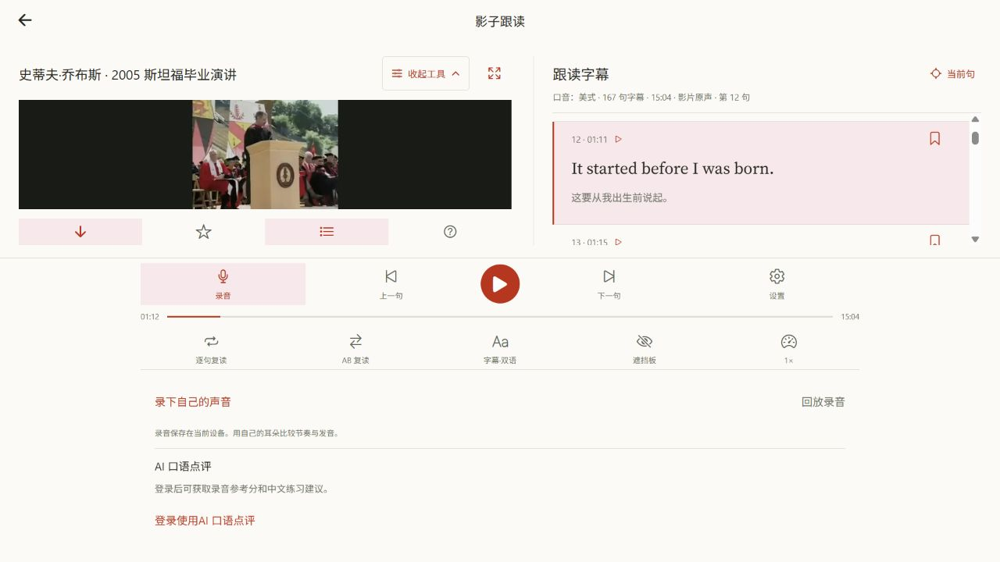

# 低成本口语 AI 点评正式发布

用户于 2026-10-02 授权提交并推送远端 main、部署正式 Web。[黑洞英语](https://blackholeenglish.com) 已上线 EvoLink Gemini 2.5 Flash 音频点评，复用服务端现有密钥。跟读页面打开「录音」后可见「AI 口语点评」，登录并录下一句短字幕后获取参考分、听到的英文和中文建议。参考分供练习使用，不作为考试成绩。

## 版本与范围

| 项目 | 发布结果 |
| --- | --- |
| 功能及生产兼容性代码 | main `98aa0788`；后续提交仅补充发布记录 |
| Cloudflare API | `a70ec6f8-9bcc-4c33-8b10-cb487a49c6f0` |
| Cloudflare Web | `0107a547-53cf-41b2-8f86-2923df6553af` |
| 客户端入口 | `entry-f149bba2001c5e82feeb85ebc1c9aac9.js` |
| 入口 SHA-256 | `296c2ca465d1cd12ae89f33468d29aeab862eab51d8edc99c36c30a273c929c7` |

配套 API 继续使用 Cloudflare／D1／私有 R2。D1 的 0006／0007 已增量迁移，发布前复查没有待执行项。Neon 只保留开发路径；既有账号、阅读记录和口语素材继续保留。此前正式版已有封面和真实素材，本次纳入相应源文件，避免部署时回退。尚未完成的字幕文档导出保留在原工作区，本次不发布。

## 发布修复与配置

实际 Workers 运行时不接受 `redirect: "error"`，导致音频请求尚未发送就失败。共享 EvoLink 适配器改用 `redirect: "manual"`，所有 3xx 响应进入稳定上游错误，不跟随跳转。真实 Workers 运行时回归使用假上游，不产生模型费用。

R2 原上传凭证已于 10 月 1 日失效。本次更换凭证保持 `waikan-2026-audio` 单桶 Object Read & Write 权限和一周期限，并同步本地私有配置与 Worker 加密 secrets。**新凭证于 2026-10-09 到期，届时需续期。** 密钥、签名 URL 和验证身份不进入 Git 或客户端包。EvoLink 使用原有加密密钥，音频模型默认 `gemini-2.5-flash`、20 秒超时、每账号每天最多 50 次新尝试。

## 验证

- 独立发布工作区通过提交的锁文件重新安装依赖，客户端 89 组／480 项测试、Cloudflare 131 项测试和契约 56 项测试通过；全工作区类型检查与 Lint 通过，客户端仅保留既有 24 条警告。跳转修复后相关三个文件／67 项测试、服务端及 Cloudflare 类型检查、服务端 Lint 再次通过。
- 使用正式变量导出 39 条 Web 路由，预压缩入口并复制 214 期外刊正文。客户端密钥检查扫描 1066 个文件和六项已配置密钥，未发现泄漏；API 与 Web dry-run 均通过。
- 正式 API 两项健康检查返回 200。合成账号上传本机生成的「Stay curious.」短句 WAV，实际 EvoLink 点评返回 AI 参考分与中文反馈。同键重放、不同键成功缓存和历史查询均返回同一结果，只创建一次点评尝试。验证后删除合成账号及私有测试对象，回读确认用户、点评和资产记录无残留。
- 正式站首页、素材详情、影子跟读及登录页面返回 200，均引用本次入口。解压后的 29,371,066 字节 JavaScript 与本地发布文件逐字节一致；gzip、内容类型及入口 SHA-256 检查通过。
- 口语目录保留十份真实素材、6865 句字幕，三份已退役示例返回 404；正式影片 Range 请求返回 206，正式域名 CORS 正常。
- 真实浏览器读取乔布斯演讲和字幕，打开录音面板显示「AI 口语点评」及来宾登录提示，浏览器错误日志为空。验收未开启麦克风。

详细原始报告保存在被 Git 忽略的 `.local-test-results/speaking-coach-release/`，使用说明见 [口语 AI 点评](2026-10-02-speaking-pronunciation.md)。
