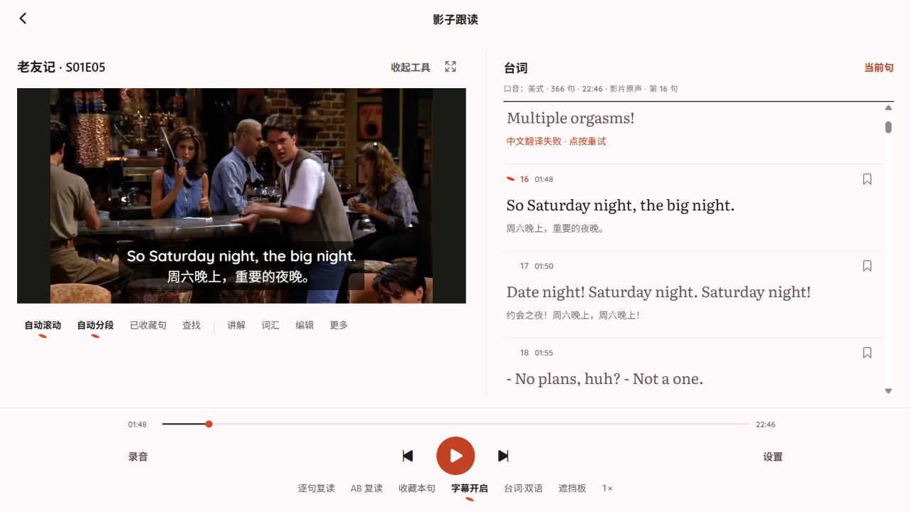
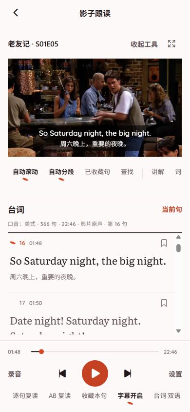

# 视频底部字幕与台词面板

影子跟读页在视频画面底部增加同步字幕，默认开启。下方播放工具栏的「字幕开启／字幕关闭」独立控制这层字幕；右侧列表标题改为「台词」，原「字幕·双语」改为「台词·双语」，可切换双语、英文、中文或隐藏。

## 显示与播放

- 使用当前原始句子的起止时间，开始前、结束后和对白空档不显示字幕。暂停时保留当前位置的字幕，跳句和拖动进度后重新同步。
- 英文与已有中文译文居中排列，白字搭配半透明黑底；中文补齐后直接更新字幕。没有中文时只显示英文。
- 字幕不受台词搜索、收藏筛选、合并分段、语言或遮挡设置影响。音频素材保留台词工具，不提供视频字幕开关。
- 更新字幕与译文时复用现有 VideoView，保留媒体来源、播放位置、播放状态和倍速。
- 支持标准浏览器全屏 API 时，将包含字幕的整个视频容器请求全屏。原生端和不支持容器全屏的浏览器沿用系统视频全屏；系统全屏目前不包含这层自绘字幕。

## 验证

客户端全量 109 套、595 项测试通过，类型检查和 Lint 通过；Lint 的 24 条警告来自已有文件。最后调整视频尺寸后，播放器相关 3 套、15 项回归测试、类型检查及修改文件的 ESLint 再次通过。生产 Web 导出成功，共 44 条路由。

本地浏览器使用缓存的《老友记》S01E05 视频及三条中文测试译文验证：桌面字幕位于视频范围内，关闭后字幕消失、台词列表保留，播放位置不变。390×844 窄屏的视频为 358×201 像素，字幕保持在画面内，页面宽度与滚动宽度均为 390 像素。测试接口与影片仅在本机提供，此次未部署线上。

